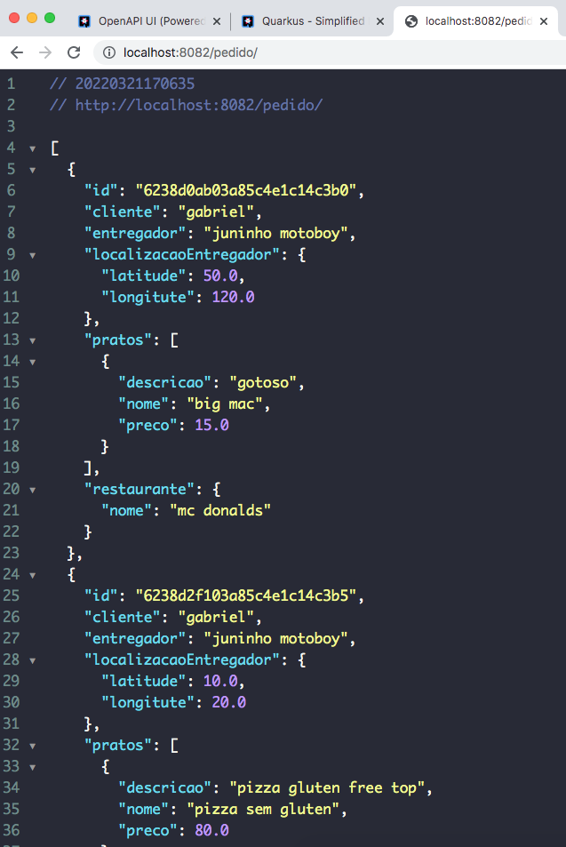

# quarkus-microservices-java
Creating microservices with quarkus like uber eats and ifood

# Instructions 
1. Go to cadastro/src/main/resources and execute docker-compose up to create instances of mongoDB, postgres and artemismq. This docker-compose has important configurations to run project including username and password.
2. The project has 2 main apis:

    a. Cadastro - to create restaurants and dish (complete CRUD created with Panache Quarkus)
    
    b. Pedido - to create request for restaurantes with location and more, I used MongoDB for it. (PanacheMongoEntity).
    
3. All APIS have swagger configurated, you can make request accessing: http://localhost:8082/q/swagger-ui/ (please, check the port of each API)

Example of request (showing all requests of the database:



# Important notes:

``` How to run quarkus API: inside application folder, run  ./mvnw compile quarkus:dev ```

``` How to add extension on command line: mvn quarkus:add-extension -Dextensions="smallrye-openapi, resteasy-jsonb, mongodb-panache" ```

# Software and Plugin Suggestion: 

Compass MongoDB to test connection and view MongoDB database - https://www.mongodb.com/products/compass

DBeaver to Postgres database - https://dbeaver.io/download/

Quarkus plugin for InteliiJ to create faster projects - https://www.jetbrains.com/help/idea/quarkus.html

Docker - https://www.docker.com/

GraalVM (Cloud Native and faster than JVM) - https://www.graalvm.org/

